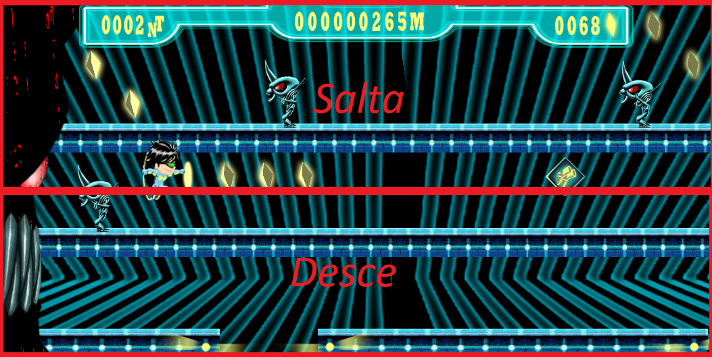

<body>
<h1 align="center">Jogo Runner de plataforma com Unity</h1>
<h2 align="center">Código Fonte escrito em C#</h2>
<h3>
Projeto pensado para rodar em dispositivos android.
</h3>
     <h3>Conceito geral</h3>
    

        

            O personagem precisa desviar dos inimigos, coletar power up's e cristais para progredir no jogo enquanto
            aumenta
            a pontuação. Sua velocidade aumenta gradativamente no decorrer das fases além de alterar o comportamento dos
            inimigos. As plataformas, itens coletáveis e inimigos são gerador por um RNG (Random Number Generator)
            garantindo que as fases sempre tenham uma aparencia diferente ao iniciar o jogo.
        

    

    <h3 align="center">Configuração de Controle</h3>
    
Tocar na parte de cima da tela faz o personagem pular. Tentar pular muito rapido após subir uma plataforma
        compromete a altura do salto.

    
Tocar na parte de baixo da tela faz o personagem descer da plataforma que está.

    

        
    

    
 Programador: <a href="https://github.com/KleitonMQ">Kleiton MQ.</a>

    
 Artista: Thiago Dadespo

    <h3 align="center">Gameplay:</h3>
    

        <video width="500" src="Gameplay/Gameplay 1.mp4" type="video/mp4" controls height="400"></video>
        <video width="500" src="Gameplay/Gameplay 2.mp4" type="video/mp4" controls height="400"></video>
    

    
OBS1: A fase deveria ser maior, mas para demonstração foi reduzido o tempo em cada uma.

    
OBS2:No momento o desenvolvimento está suspenso por decisão dos integrantes do grupo.

</body>